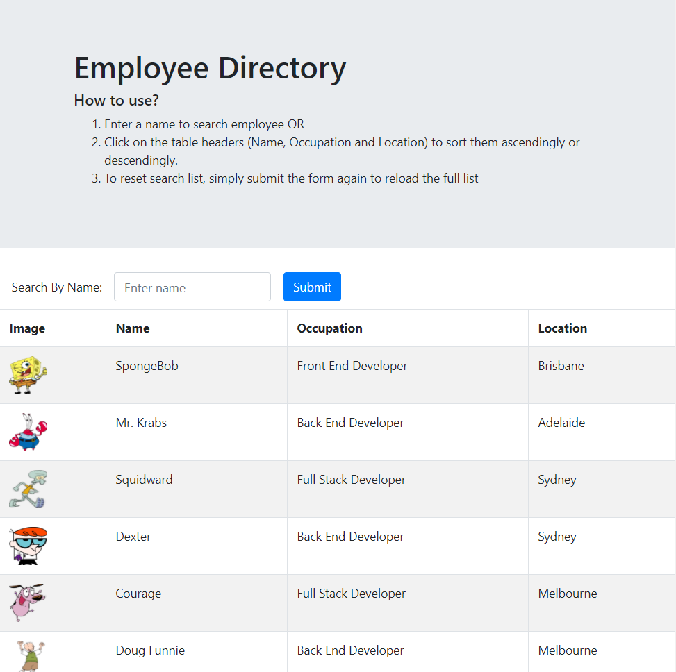

# Employee Directory
## Description

An React application that allows users to view entire employee directory, search employees by name and sort in ascending/descending order by name, occupation and location so that they will have quick access to employees' information

[](https://opensource.org/licenses/MIT)


## Installation

```
No installation is required. View the live site: https://zanhong.github.io/19-employee-directory/
```

## Usage

Click [here](https://zanhong.github.io/19-employee-directory/) to launch the application

### How To Use
#### Note: Usage instructions can be found on the application itself!
1. Enter a name to search employee OR
2. Click on the table headers (Name, Occupation and Location) to sort them ascendingly or descendingly
3. To reset search list, simply submit the form again to reload the full list


### Screenshots



## License

License for this project: MIT

## Contributing

1. Fork/Clone this repo
2. Hack away!
3. Create a new pull request
4. Good commits will be accepted


## Questions

If you have any questions/doubts, feel free to contact me via:
* GitHub: [https://github.com/ZanHong](https://github.com/ZanHong)
* Email: [mokzanhong92@hotmail.com](mailto:mokzanhong92@hotmail.com)
